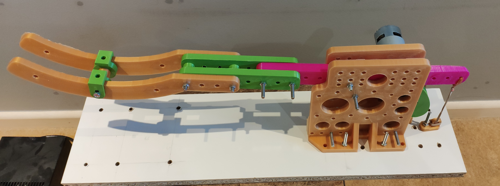
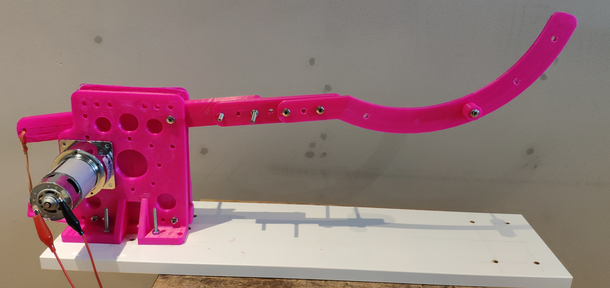
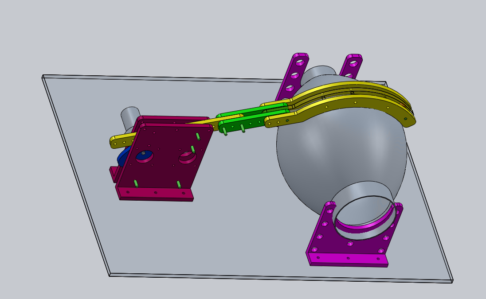

# Simple emergency Ventilator

A Simple and 3D-printable Emergency Ventilator for COVID-19.

The only part needs to purchase specific for this ventilator is the DC gear motor. The BVM is always needed with or without this machine. The lab power supply is widely available and it can be borrowed from the school lab.

## Main Components

* Bag Valve Mask (BVM)
* Lab power supply (0-30V, 3A)
* DC gear motor (35W, 12V or 24V, 15RPM)
* Base board (MDF, 25mm)

## 3D printed parts
* Cam
* Arm set (includes three sections to be printed by small 3D printer)
* Arm support panel x 2
* BVM support stand x 2

## MK2 
### Image

### Video on Youtube

## Mk1 
### Image

### Video on Youtube

## Initla Model
### Image

### Video on Youtube

